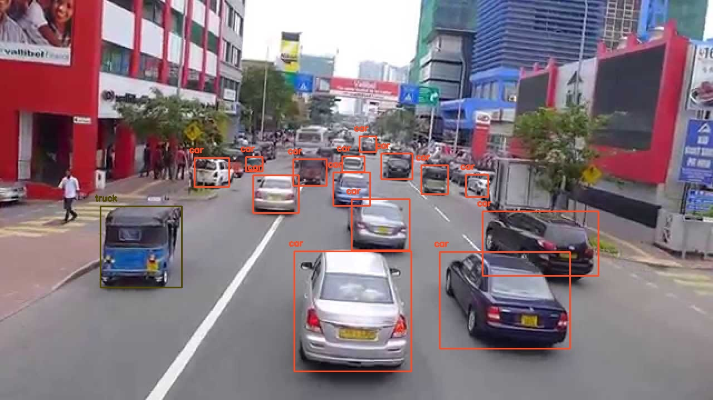

# Detekcija vozila na slici
 
 ## Potrebne biblioteke
 Potrebno je imati _Python 3_ (i _pip_), te sljedeće biblioteke:
  * opencv
  * numpy
 
 Pokrenuti `python3` u terminalu da provjerite da li je instaliran. Ako nije instaliran koristite
 
  `sudo apt-get install python3`
  
 U slučaju da _pip_ nije instaliran, koristite upute sa [linka](https://www.geeksforgeeks.org/how-to-install-pip-on-windows/) kako biste ga instalirali.
  
 Pokrenuti sljedeću naredbu u terminalu za instaliranje gore navedenih dependency-a:
 
  `pip install numpy opencv-python`

 ## YOLO (You Only Look Once)

 Potrebno je downloadovati pretrenirani YOLO v3 weights file sa ovog [linka](https://pjreddie.com/media/files/yolov3.weights) i postaviti ga u trenutni direktorij ili ga je moguće direktno downloadovati u trenutni direktorij kroz terminal koristeći 
 
 `wget https://pjreddie.com/media/files/yolov3.weights`
 
 Sliku nad kojom će se primijeniti detekcija vozila potrebno je smjestiti u folder `images`. Pod uslovom da su svi ostali fajlovi u trenutnom direktoriju, naredba ispod će primijeniti detekciju vozila na ulaznu sliku `test.jpg`:
 
 `python yolo_opencv.py --image ./images/test.jpg --config yolov3.cfg --weights yolov3.weights --classes yolov3.txt`
 
 **Način pozivanja komande** 
 
 _python yolo_opencv.py --image /path/do/ulazne/slike --config /path/do/config/fajla --weights /path/to/weights/file --classes /path/do/classes/filea_
 
 
 ### Primjer izlaza :
 
 
